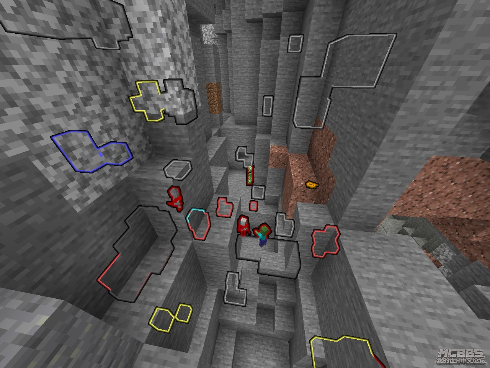
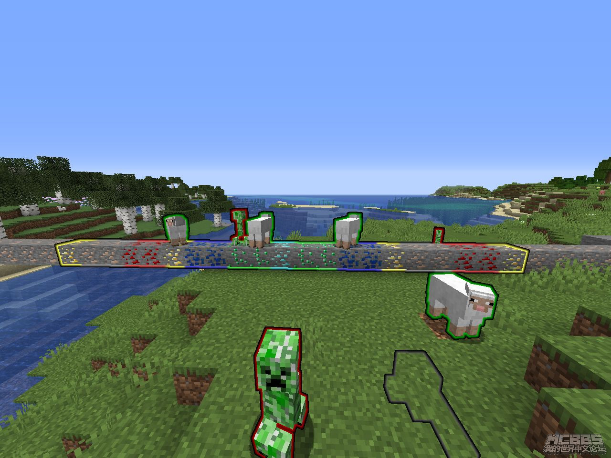

# Detection-Radar-v1.2-1.14.X_1.17.X-Datapack

## Use Tutorial

The module can view the outline of minerals and some entities through the box

After loading the module, you will get the **radish fishing rod**, which is the radar, **Right click to use it**

Enter command to get the radar/enter the radar editing interface, where you can set the radar detection range and detection object:

`trigger drget @ s set 1`

## Use effect

